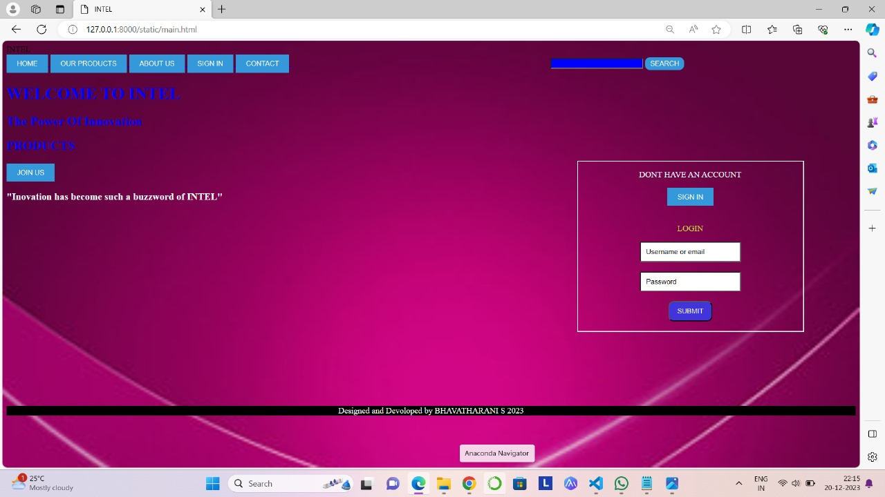
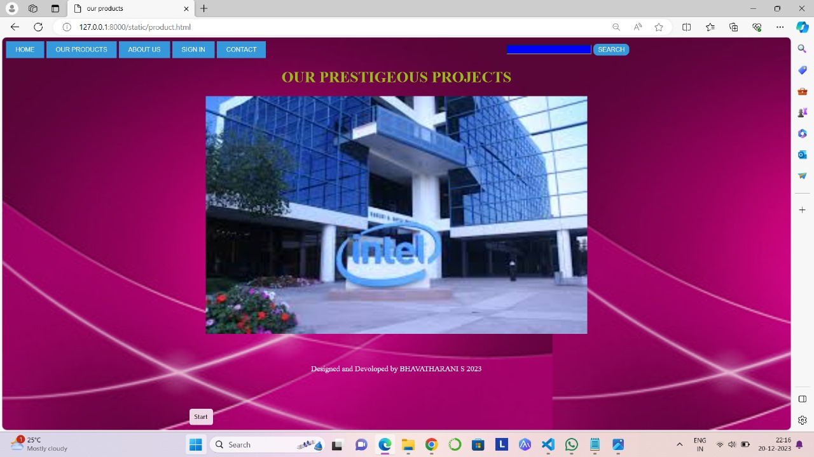
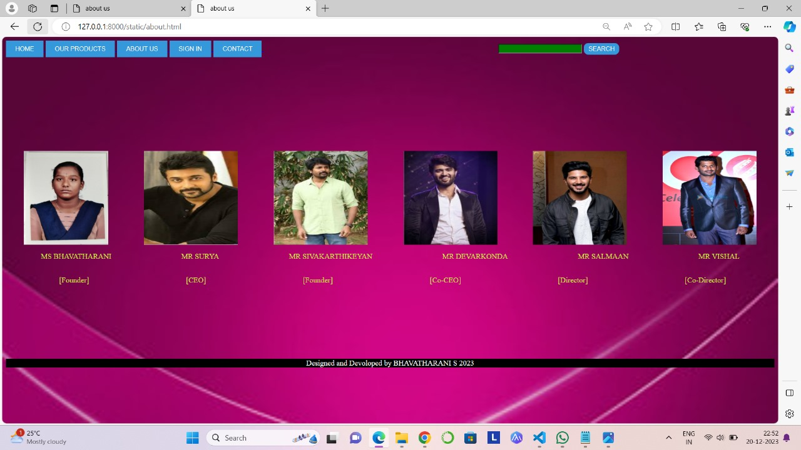
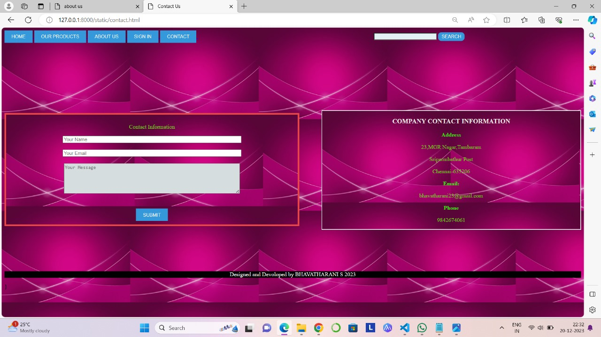

# Web Design for a Software Product Company

## AIM:

To design a static website for a software product company company.

## DESIGN STEPS:

### Step 1:

Requirement collection.

### Step 2:

Creating the layout using HTML and CSS.

### Step 3:

Updating the sample content.

### Step 4:

Choose the appropriate style and color scheme.

### Step 5:

Validate the layout in various browsers.

### Step 6:

Validate the HTML code.

### Step 6:

Publish the website in the given URL.

## PROGRAM :
```
main.html

INTEL
<html>
<title>INTEL</title>
<style>
    body{
        background:url(background.jpeg);
        background-size: cover;
        
    }

    h1{
        color: blue;
    }
    h2{
        color: blue;
    }
    h3{
        color:white;
        align:center;
    }

/* the main window options*/
.styled form {
            margin margin-top: 20px;
            display: flex;
            justify-content: space-between;
        }
        .styled [type="button"] {
            padding: 10px 20px; /* button size */
            background-color: #3498db; /* initial background color */
            color: #ffffff; /*initial text color */
            border: none;
            transition: background-color 0.3s, color 0.3s; /*smooth transition */
        }
        .styled [type="button"]:hover {
            background-color:purple; /*background color on hover */
            color:aliceblue; /*text color on hover */
        }
        .styled [type="submit"] {
            border-radius: 10px;
            padding: 5px 10px; /* button size */
            background-color: #3498db; /* initial background color */
            color: #ffffff; /*initial text color */
            border: none;
            transition: background-color 0.3s, color 0.3s; /*smooth transition */
        }
        .styled [type="submit"]:hover {
            background-color:purple; /*background color on hover */
            color:#ffffff; /*text color on hover */
        }
        .styled [type="text"] {
            margin-left: 500px;
            transition: background-color 0.3s; 
            background-color:blue;
        }
        .styled input[type="text"]:focus {
    /* Change background color when input is focused */
    background-color:rgb(224, 127, 224); /* Adjust the color as needed */
}

.login{
    margin-top: -100;
    margin-left: 1100;
    margin-right: 100;    
    background:url(123.jpg);

    scroll-padding-left: 5px;
    border:2px solid white;
}
.login input[type="button"] {
    padding: 10px 20px; /*  button size */
    background-color: #3498db;
    color: #ffffff;
    border: none;
    cursor: pointer;
    transition: background-color 0.3s, color 0.3s;
}
.login input[type="button"]:hover {
    color:#39bfd4;
    background-color:rgb(204, 32, 204);
}
.login input[type="submit"]{
    padding: 10px 15px; /*  button size */
    background-color:#4234db;
    color: #ffffff;
    border-radius: 10px;
    cursor: pointer;
    transition: background-color 0.3s, color 0.3s;
}
.login input[type="submit"]:hover {
    color:#d54f23;
    background-color:chocolate;
}
.login input[type="text"] { 
    padding: 10px; /* Add padding for better appearance */
    transition: background-color 0.3s; /* Add transition for a smooth effect */
        /* Set initial background color */
        background-color: #ffffff;
}
.login input[type="text"]:focus {
    /* Change background color when input is focused */
    background-color:blue; /* Adjust the color as needed */
}
.join{
    padding: 10px 20px; /*  button size */
    background-color: #3498db;
    color: #ffffff;
    border: none;
    cursor: pointer;
    transition: background-color 0.3s;
}
.join:hover {
    color: blue;
    background-color: blue;
}

/main html/
</style>
<body >
    <form class="styled ">
        <div class=>
            <a href="mainpage">
                <input type="button" value="HOME">
            </a>
            <a href="products">
                <input type="button" value="OUR PRODUCTS">
            </a>

            <a href="about">
                <input type="button" value="ABOUT US">
            </a>
            <a href="sign">
                <input type="button" value="SIGN IN">
            </a>
            <a href="contact">
                <input type="button" value="CONTACT">
            </a>  
            <input type="text">
            <input type="submit"value="SEARCH">  
        </div>
    </form>

    <h1>WELCOME TO INTEL</h1>
    <h2>The Power Of Innovation</h2>
    <h2>PRODUCTS</h2>
    <a href="sign">
        <input type="button" value="JOIN US" class="join">
    </a>  
    
    <h3>"Inovation has become such a buzzword of INTEL"</h3>

         <center>
        <div class="login">
            <div class="login-box">
            <p style="color: white;">DONT HAVE AN ACCOUNT</p>
            <a href="sign">
                <input type="button" value="SIGN IN"><br><br>
            </a>  
            <p style="color: rgb(198, 219, 45);">LOGIN</p>
            <input type="text" value="Username or email" ><br><br>
            <input type="text" value="Password"><br><br>
            <a href="products">
                <input type="submit" value="SUBMIT"><br><br>
            </a>  
        </div>
        </div>
    </center>

</body>
<footer style="back<!DOCTYPE html>
<html>
<head>
    <title>Contact Us</title>
    <style>
        b{
            color:rgb(60, 238, 10)
        }
        p {
            color: rgba(114, 236, 15, 0.882);
        }

        body {
            background:url(background.jpeg);
        }

        .yourinfo {
            background:url(background.jpeg);
            border:5px solid rgb(232, 71, 71);
            margin-right: 800px ;
            
            margin-top: 200px; /* Adjusted margin-top */
            padding: 10px; /* Added padding for better spacing */
        }
        .yourinfo input[type="text"] {
            width: 500px;
            transition: background-color 0.3s; 
        }
        .yourinfo input[type="text"]:focus {
    /* Change background color when input is focused */
    background-color: #2278c3; /* Adjust the color as needed */
}

        .buttons {
            margin-top: 20px;
            padding: 10px 20px;
            background-color: #3498db;
            color: #ffffff;
            border: none;
            cursor: pointer;
            transition: background-color 0.3s, color 0.3s;
        }

        .buttons:hover {
            color: rgb(18, 242, 66);
            background-color: #29ef44;
        }
        .styled form {
            display: flex;
            justify-content: space-evenly;
        }
        .styled form {
            margin margin-top: 20px;
            display: flex;
            justify-content: space-between;
        }
        .styled [type="button"] {
            padding: 10px 20px; /* button size */
            background-color: #3498db; /* initial background color */
            color: #ffffff; /*initial text color */
            border: none;
            transition: background-color 0.3s, color 0.3s; /*smooth transition */
        }
        .styled [type="button"]:hover {
            background-color:rgb(170, 206, 12); /*background color on hover */
            color:aliceblue; /*text color on hover */
        }
        .styled [type="submit"] {
            border-radius: 10px;
            padding: 5px 10px; /* button size */
            background-color: #3498db; /* initial background color */
            color: #ffffff; /*initial text color */
            border: none;
            transition: background-color 0.3s, color 0.3s; /*smooth transition */
        }
        .styled [type="submit"]:hover {
            background-color:rgb(195, 222, 47); /*background color on hover */
            color:#d1209f; /*text color on hover */
        }
        .styled [type="text"] {
            margin-left: 500px;
            transition: background-color 0.3s; 
            background-color:rgb(227, 241, 244);
        }
        .styled input[type="text"]:focus {
    /* Change background color when input is focused */
    background-color:rgb(81, 21, 220); /* Adjust the color as needed */
}
    
.company{

margin-left: 900px;
margin-top: -330px;
background:url(background.jpeg);

scroll-padding-left: 5px;
border:2px solid white;
}
.message textarea {
        background-color: rgb(214, 221, 222); /* Set the default background color */
        color: black; /* Set the default text color */
    }

    /* Styles for the text area when it is in focus */
.message    textarea:focus {
        background-color: rgb(215, 215, 227); /* Set the background color when in focus */
        color: rgb(27, 209, 51); /* Set the text color when in focus */
    }
    </style>
</head>
<body>
    <form class="styled">
        <div>
            <a href="mainpage">
                <input type="button" value="HOME">
            </a>
            <a href="products">
                <input type="button" value="OUR PRODUCTS">
            </a>
            <a href="about">
                <input type="button" value="ABOUT US">
            </a>
            <a href="sign">
                <input type="button" value="SIGN IN">
            </a>
            <a href="contact">
                <input type="button" value="CONTACT">
            </a>
            <input type="text" >
            <input type="submit" value="SEARCH">
        </div>
    </form>
    <div class="yourinfo">
        <center>
        <p>Contact Information</p>
        <div>            
            <input type="text" maxlength="100" placeholder="Your Name"><br><br>
            <input type="text" maxlength="100" placeholder="Your Email"><br><br>
            <div class="message">
            <textarea rows="5" cols="65" placeholder="Your Message"></textarea><br><br>
        </div>
            <input type="button" value="SUBMIT" class="buttons">
        
        </center>
        </div>
    </div>
    <div class="company">
        <center>
        <h3 style="color: rgba(244, 245, 240, 0.934);">COMPANY CONTACT INFORMATION</h3>
       <p> <b >Address</b></p>
        <p >23-56P,</p>
        <p >Deveradeesanahalli Varthur Hobli,</p>
        <p >Bangalore</p>
        <b >Email:</b>
        <p >shree45@gmail.com</p>
        <b >Phone</b>
        <p >9678084567</p>
    </center>
    </div>
</body>
<footer style="background-color:black;margin-top: 118px; border: none;">
    <P style="color:#ffffff ;"align="center">Designed and Devoloped by BHAVATHARANI S 2023 </P>
</footer>
</html>
        

        .


<html>
    <title>our products</title>
    <style>  
    body{
        background:url(background.jpeg);
        background-size:contain;
    } 
    h1{
        color: rgb(155, 185, 22);
    }  
    .styled form {
            margin margin-top: 20px;
            display: flex;
            justify-content: space-between;
        }
        .styled [type="button"] {
            padding: 10px 20px; /* button size */
            background-color: #3498db; /* initial background color */
            color: #ffffff; /*initial text color */
            border: none;
            transition: background-color 0.3s, color 0.3s; /*smooth transition */
        }
        .styled [type="button"]:hover {
            background-color:green; /*background color on hover */
            color:blue; /*text color on hover */
        }
        .styled [type="submit"] {
            border-radius: 10px;
            padding: 5px 10px; /* button size */
            background-color: #3498db; /* initial background color */
            color: #ffffff; /*initial text color */
            border: none;
            transition: background-color 0.3s, color 0.3s; /*smooth transition */
        }
        .styled [type="submit"]:hover {
            background-color:green; /*background color on hover */
            color:#ffffff; /*text color on hover */
        }
        .styled [type="text"] {
            margin-left: 500px;
            transition: background-color 0.3s; 
            background-color:blue;
        }
        .styled input[type="text"]:focus {
    /* Change background color when input is focused */
    background-color:rgb(224, 127, 224); /* Adjust the color as needed */
}
</style>
    
    <body>
        <form class="styled ">
            <div class=>
                <a href="mainpage.html">
                    <input type="button" value="HOME">
                </a>
                <a href="products.html">
                    <input type="button" value="OUR PRODUCTS">
                </a>
                <a href="about.html">
                    <input type="button" value="ABOUT US">
                </a>
                <a href="sign.html">
                    <input type="button" value="SIGN IN">
                </a>
                <a href="contact.html">
                    <input type="button" value="CONTACT">
                </a>  
                <input type="text">
                <input type="submit"value="SEARCH">  
            </div>
        </form>
        
        <center>
            <h1 >OUR PRESTIGEOUS PROJECTS</h1>
            
        </center>
    </body>
    <footer style="background-color:#092bc2(53, 49, 193);margin-top: 64; border: none;">
        <P style="color:#ffffff; ;"align="center">Designed and Devoloped by BHAVATHARANI S 2023 </P>
    </footer>
</html>

about.html


<html>
<title>about us</title>
<style>
    p{
        color: rgb(211, 233, 68);
    }
    body{
        background:url(background.jpeg)
        background-size: cover;
    }
    .styled form {
            margin margin-top: 20px;
            display: flex;
            justify-content: space-between;
        }
        .styled [type="button"] {
            padding: 10px 20px; /* button size */
            background-color: #3498db; /* initial background color */
            color: #ffffff; /*initial text color */
            border: none;
            transition: background-color 0.3s, color 0.3s; /*smooth transition */
        }
        .styled [type="button"]:hover {
            background-color:purple; /*background color on hover */
            color:aliceblue; /*text color on hover */
        }
        .styled [type="submit"] {
            border-radius: 10px;
            padding: 5px 10px; /* button size */
            background-color: #3498db; /* initial background color */
            color: #ffffff; /*initial text color */
            border: none;
            transition: background-color 0.3s, color 0.3s; /*smooth transition */
        }
        .styled [type="submit"]:hover {
            background-color:purple; /*background color on hover */
            color:#ffffff; /*text color on hover */
        }
        .styled [type="text"] {
            margin-left: 500px;
            transition: background-color 0.3s; 
            background-color:green;
        }
        .styled input[type="text"]:focus {
    /* Change background color when input is focused */
    background-color:rgb(224, 127, 224); /* Adjust the color as needed */
}
.photos{
    display:flex;
    justify-content: space-around;
    margin-top: 200px;
}
.names{
    display:flex;
    justify-content: space-around;

}
.position {
    display: flex;
    justify-content: space-around;
    margin-left: 10px;
    border-image:5px;
    border-image: peach;
}

</style>
<body>
    <form class="styled ">
        <div class=>
            <a href="mainpage">
                <input type="button" value="HOME">
            </a>
            <a href="products">
                <input type="button" value="OUR PRODUCTS">
            </a>
            <a href="about">
                <input type="button" value="ABOUT US">
            </a>
            <a href="sign">
                <input type="button" value="SIGN IN">
            </a>
            <a href="contact">
                <input type="button" value="CONTACT">
            </a>  
            <input type="text">
            <input type="submit"value="SEARCH">  
        </div>
    </form>
    <div class="photos">
    
    
    
    
    
    
</div>
<div CLASS="names">     
    <P>MISS BHAVATHARANI</P>    
    <P>MR SURIYA</P>
    <P>MR SIVAKARTHIKEYAN</P>    
    <P>MR DEVARKONDA</P>    
    <P>MR SALMAAN</P>    
    <P>MR VISHAL</P>        
</div>
<DIV class="position">
    <p>[Founder]</p>
    <p>[CEO]</p>
    <p>[Founder]</p>
    <p>[Co-CEO]</p>
    <p>[Director]</p>
    <p>[Co-Director]</p>
</DIV>
</body>
<footer style="background-color:Black;margin-top: 143; border: none;">
    <P style="color:#ffffff; ;"align="center">Designed and Devoloped by BHAVATHARANI S 2023 </P>
</footer>
</html>

sign.html

<!DOCTYPE html>
<html>
<head>
    <title>Sign Up</title>
    <style>
        body {
            background:url(background.jpeg);
            background-size: cover;
            color: rgb(226, 217, 50);
            font-family: Arial, sans-serif;
        }

        .form {
            margin: 0 auto;
            width: 300px;
            padding: 20px;
        }

        label {
            color: chocolate;
        }

        .purpose {
            color: CYAN;
        }

        .buttons {
            margin-top: 20px;
            padding: 10px 20px;
            background-color: #3498db;
            color: #ffffff;
            border: none;
            cursor: pointer;
            transition: background-color 0.3s, color 0.3s;
        }

        .buttons:hover {
            color: blue;
            background-color: #4234db;
        }
        .styled form {
            margin margin-top: 20px;
            display: flex;
            justify-content: space-between;
        }
        .styled [type="button"] {
            padding: 10px 20px; /* button size */
            background-color: #3498db; /* initial background color */
            color: #ffffff; /*initial text color */
            border: none;
            transition: background-color 0.3s, color 0.3s; /*smooth transition */
        }
        .styled [type="button"]:hover {
            background-color:purple; /*background color on hover */
            color:aliceblue; /*text color on hover */
        }
        .styled [type="submit"] {
            border-radius: 10px;
            padding: 5px 10px; /* button size */
            background-color: #3498db; /* initial background color */
            color: #ffffff; /*initial text color */
            border: none;
            transition: background-color 0.3s, color 0.3s; /*smooth transition */
        }
        .styled [type="submit"]:hover {
            background-color:purple; /*background color on hover */
            color:#ffffff; /*text color on hover */
        }
        .styled [type="text"] {
            margin-left: 500px;
            transition: background-color 0.3s; 
            background-color:bisque;
        }
        .styled input[type="text"]:focus {
    /* Change background color when input is focused */
    background-color:rgb(224, 127, 224); /* Adjust the color as needed */
}
.text{
    transition: background-color 0.3s, color 0.3s;

}
.text :focus{
    background-color:blue;  
}
.full{
    background:url(background.jpg);
    padding: 10px;
    border:4px double white;
}
    </style>
</head>
<body>
    <form class="styled ">
        <div class=>
            <a href="mainpage">
                <input type="button" value="HOME">
            </a>
            <a href="products">
                <input type="button" value="OUR PRODUCTS">
            </a>
            <a href="about">
                <input type="button" value="ABOUT US">
            </a>
            <a href="sign">
                <input type="button" value="SIGN IN">
            </a>
            <a href="contact">
                <input type="button" value="CONTACT">
            </a>  
            <input type="text">
            <input type="submit"value="SEARCH">  
        </div>
    </form>
    <div class="form">
        <p align="center">JOIN THE GROUP OF INTEL</p>
        <p align="center">DON'T HAVE AN ACCOUNT YET?</p>
        <div class="full">
        <div class="text">
           
        <label>Unique Username</label>
        <input type="text" value="username"><br><br>
        <label>Email</label>
        <input type="email" value="email"><br><br>
        </div>
        <label>DOB</label>
        <input type="date"><br><br>
        <label>Gender</label><br>
        <div class="purpose">
            <input type="radio" name="gender">Male<br>
            <input type="radio" name="gender">Female<br><br>
        </div>
        <label>Purpose</label><br>
        <div class="purpose">
            <input type="radio" name="purpose">Study<br>
            <input type="radio" name="purpose">Work<br>
            <input type="radio" name="purpose">Partnership<br><br>
        </div>
        <label>Click the checkbox to prove you are human</label>
        <input type="checkbox"><br><br>
        
            <input type="submit" value="CREATE ACCOUNT" class="buttons">
            <input type="submit" value="DOWNLOAD SOFTWARE"class="buttons">
        
    </div>
</div>
</body>
<footer style="background-color:black; border: none;">
    <P style="color:#ffffff ;"align="center">Designed and Devoloped by BHAVATHARANI S 2023 </P>
</footer>
</html>
            
contact.html

<!DOCTYPE html>
<html>
<head>
    <title>Contact Us</title>
    <style>
        b{
            color:rgb(60, 238, 10)
        }
        p {
            color: rgba(114, 236, 15, 0.882);
        }

        body {
            background:url(background.jpeg);
        }

        .yourinfo {
            background:url(background.jpeg);
            border:5px solid rgb(232, 71, 71);
            margin-right: 800px ;
            
            margin-top: 200px; /* Adjusted margin-top */
            padding: 10px; /* Added padding for better spacing */
        }
        .yourinfo input[type="text"] {
            width: 500px;
            transition: background-color 0.3s; 
        }
        .yourinfo input[type="text"]:focus {
    /* Change background color when input is focused */
    background-color: #2278c3; /* Adjust the color as needed */
}

        .buttons {
            margin-top: 20px;
            padding: 10px 20px;
            background-color: #3498db;
            color: #ffffff;
            border: none;
            cursor: pointer;
            transition: background-color 0.3s, color 0.3s;
        }

        .buttons:hover {
            color: rgb(18, 242, 66);
            background-color: #29ef44;
        }
        .styled form {
            display: flex;
            justify-content: space-evenly;
        }
        .styled form {
            margin margin-top: 20px;
            display: flex;
            justify-content: space-between;
        }
        .styled [type="button"] {
            padding: 10px 20px; /* button size */
            background-color: #3498db; /* initial background color */
            color: #ffffff; /*initial text color */
            border: none;
            transition: background-color 0.3s, color 0.3s; /*smooth transition */
        }
        .styled [type="button"]:hover {
            background-color:rgb(170, 206, 12); /*background color on hover */
            color:aliceblue; /*text color on hover */
        }
        .styled [type="submit"] {
            border-radius: 10px;
            padding: 5px 10px; /* button size */
            background-color: #3498db; /* initial background color */
            color: #ffffff; /*initial text color */
            border: none;
            transition: background-color 0.3s, color 0.3s; /*smooth transition */
        }
        .styled [type="submit"]:hover {
            background-color:rgb(195, 222, 47); /*background color on hover */
            color:#d1209f; /*text color on hover */
        }
        .styled [type="text"] {
            margin-left: 500px;
            transition: background-color 0.3s; 
            background-color:rgb(227, 241, 244);
        }
        .styled input[type="text"]:focus {
    /* Change background color when input is focused */
    background-color:rgb(81, 21, 220); /* Adjust the color as needed */
}
    
.company{

margin-left: 900px;
margin-top: -330px;
background:url(background.jpeg);

scroll-padding-left: 5px;
border:2px solid white;
}
.message textarea {
        background-color: rgb(214, 221, 222); /* Set the default background color */
        color: black; /* Set the default text color */
    }

    /* Styles for the text area when it is in focus */
.message    textarea:focus {
        background-color: rgb(215, 215, 227); /* Set the background color when in focus */
        color: rgb(27, 209, 51); /* Set the text color when in focus */
    }
    </style>
</head>
<body>
    <form class="styled">
        <div>
            <a href="mainpage">
                <input type="button" value="HOME">
            </a>
            <a href="products">
                <input type="button" value="OUR PRODUCTS">
            </a>
            <a href="about">
                <input type="button" value="ABOUT US">
            </a>
            <a href="sign">
                <input type="button" value="SIGN IN">
            </a>
            <a href="contact">
                <input type="button" value="CONTACT">
            </a>
            <input type="text" >
            <input type="submit" value="SEARCH">
        </div>
    </form>
    <div class="yourinfo">
        <center>
        <p>Contact Information</p>
        <div>            
            <input type="text" maxlength="100" placeholder="Your Name"><br><br>
            <input type="text" maxlength="100" placeholder="Your Email"><br><br>
            <div class="message">
            <textarea rows="5" cols="65" placeholder="Your Message"></textarea><br><br>
        </div>
            <input type="button" value="SUBMIT" class="buttons">
        
        </center>
        </div>
    </div>
    <div class="company">
        <center>
        <h3 style="color: rgba(244, 245, 240, 0.934);">COMPANY CONTACT INFORMATION</h3>
       <p> <b >Address</b></p>
        <p >23-56P,</p>
        <p >Deveradeesanahalli Varthur Hobli,</p>
        <p >Bangalore</p>
        <b >Email:</b>
        <p >shree45@gmail.com</p>
        <b >Phone</b>
        <p >9678084567</p>
    </center>
    </div>
</body>
<footer style="background-color:black;margin-top: 118px; border: none;">
    <P style="color:#ffffff ;"align="center">Designed and Devoloped by BHAVATHARANI S 2023 </P>
</footer>
</html>
 ```       
## OUTPUT:







## Result:

Thus a website is designed for the software product company and the HTML,CSS code are validated.
